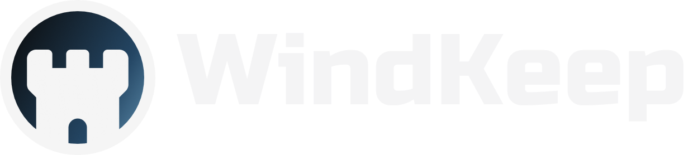

<h1>
    
</h1>

[**WindKeep**](https://windkeep.up.railway.app) is a secrets management platform that allows for teams and developers to securely store, manage, and share sensitive information. It features role-based access control, audit logging mechanisms, encrypted secret storage, and a command line interface. Check out the [**CLI documentation**](./cli/README.md) for instructions.

## Features

- **Authentication:** OAuth via Google, GitHub, or GitLab providers.
- **Multi-Tenant Architecture:** Each organization operates within its own environment, with dedicated members and projects, providing full access control and governance.
- **Project-Based Secret Management:** Organize secrets into projects for better structure and granular access control.
- **Role-Based Access Control:** Control access at both organization and project levels for maximum flexibility and security.
- **Service Tokens:** Generate service tokens for programmatic access to secrets, with environment and expiration date control.
- **Audit Logging:** Monitor your organization's activities with detailed audit logs tracking sensitive operations, such as secret changes and role updates.
- **Encrypted Secrets:** Secrets are encrypted both at rest and in transit using modern encryption standards.
- **CLI Integration:** The integrated command line allows direct interaction with the platform from the terminal, providing commands for organization and project management, pull/push operations, and automatic secret injection into local development and CI/CD pipelines.

## Stack

- **Nuxt.js** with **Vue** composition API and **Nitro** server engine.
- **OAuth** authentication with Google, GitHub, or GitLab.
- **Prisma** for **PostgreSQL** database management.
- **Redis** for caching.
- **Pinia** for state management.
- **Zod** for schema validation.
- **TypeScript**.
- **ESLint**.
- **Tailwind CSS**.
- **Framer Motion**.
- **Go** for CLI development using **Cobra**.

## Contact

Feel free to reach out to discuss collaboration opportunities or to say hello!

- [**My Email**](mailto:matheus.felipe.19rt@gmail.com)
- [**My LinkedIn Profile**](https://www.linkedin.com/in/matheus-mortari-19rt)
- [**My GitHub Profile**](https://github.com/matimortari)

## License

This project is licensed under the [**MIT License**](./LICENSE).
